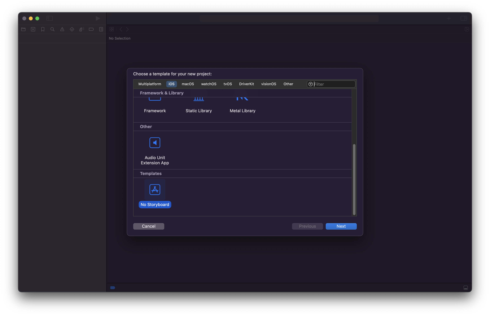

# No Storyboard Template

A simple Xcode 15 template for creating a new UIKit project without a storyboard.

## Installation

Copy the two folders to `~Library/Developer/Xcode/Templates`. If the `Templates` folder doesn't already exist, create it now.

Once copied, the template should appear at the bottom of the "New Project" dialog, when "iOS" is the selected platform.
